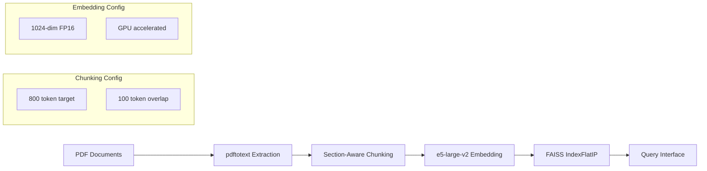
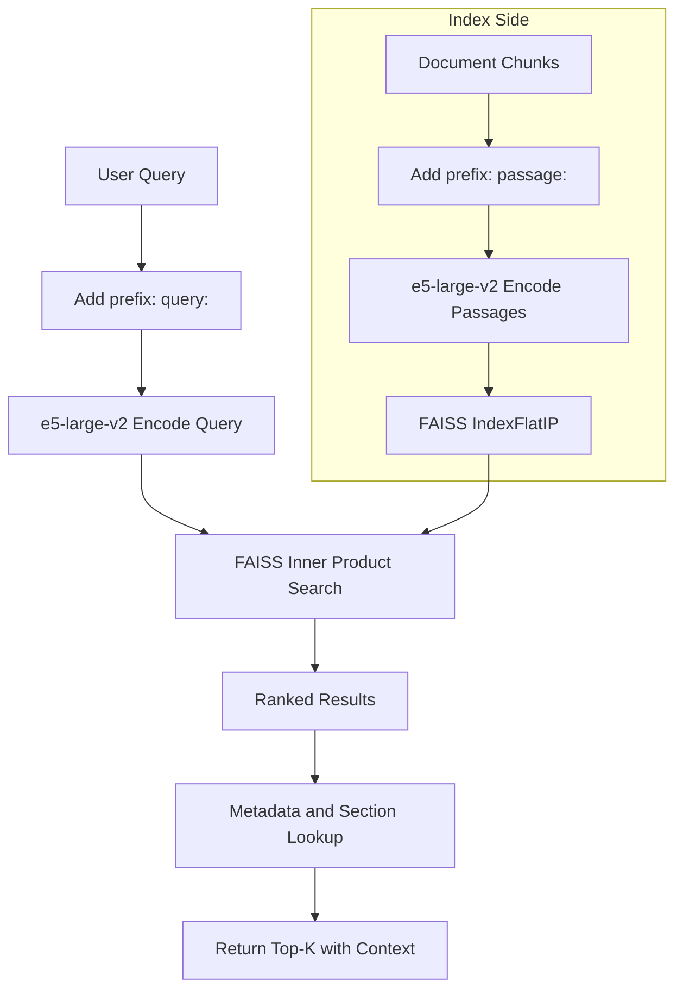

# Architecture: Research Corpus Discovery

This document describes the architecture for semantic search over PDF research corpora. The system has been tested on 10 institutions, 4,600+ documents, and approximately 75,000 chunks.

## Document Processing Pipeline

## Query Flow with Asymmetric Encoding

The system uses asymmetric encoding: documents are embedded with the `passage:` prefix during indexing, while queries use the `query:` prefix at search time.

## Component Responsibilities

| Component | Responsibility |
|---|---|
| `pdftotext` | Extract raw text from PDF documents, preserving layout where possible |
| `chunker` | Section-aware splitting at 800 token target with 100 token overlap to maintain context across boundaries |
| `embedder` | Encode chunks with e5-large-v2 (1024-dim, FP16) on GPU using `passage:` prefix |
| `indexer` | Build and persist FAISS IndexFlatIP for inner product similarity search |
| `query engine` | Accept natural language queries with `query:` prefix, perform asymmetric search against passage embeddings |
| `metadata store` | Map vector IDs back to source document, page, section, and institution |

## Scale Reference

| Metric | Value |
|---|---|
| Institutions tested | 10 |
| Documents processed | 4,600+ |
| Total chunks indexed | ~75,000 |
| Embedding dimensions | 1,024 |
| Precision | FP16 |
| Chunk target size | 800 tokens |
| Chunk overlap | 100 tokens |

## Standards

This system follows the conventions defined in **universal-protocol-v4.23**, including:

- Embedding model selection and prefix conventions (`query:` / `passage:`)
- Chunking parameters (target size, overlap)
- Index type selection (FAISS IndexFlatIP for normalized embeddings)
- Metadata schema for provenance tracking

See [universal-protocol-v4.23](../universal-protocol-v4.23) for the full specification.
